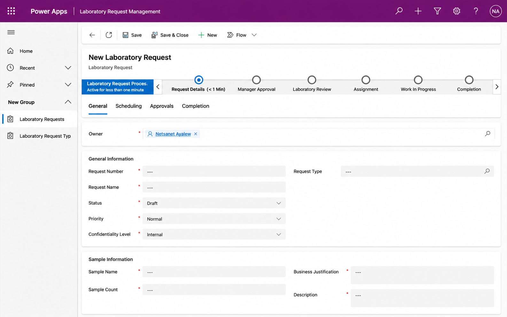
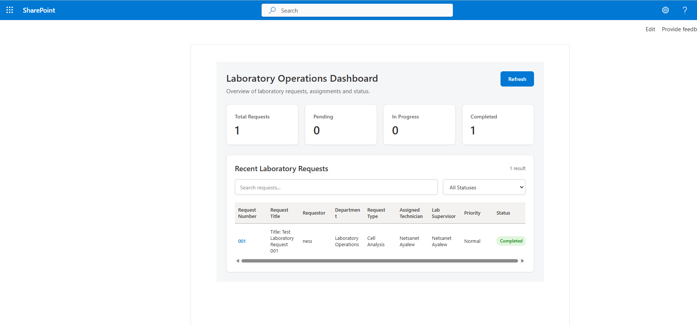

# Enterprise Laboratory Request Management

> Microsoft Power Platform portfolio project demonstrating an end-to-end laboratory service request solution using **Power Apps, Dataverse, Power Automate, SharePoint Online, SPFx, and Power BI**.

## Project Preview

### Model-Driven Laboratory Request Application



The model-driven application provides a centralized experience for creating, reviewing, assigning, tracking, and completing laboratory service requests.

### Laboratory Operations SPFx Dashboard



The SharePoint Framework dashboard provides an operational view of laboratory requests with status indicators, search, filtering, and request visibility.


## Project Overview

Laboratory service requests were managed through fragmented and largely manual processes, making it difficult to consistently track request status, coordinate reviews and approvals, maintain supporting documentation, and provide stakeholders with timely visibility into request progress.

This project centralizes the request lifecycle in Microsoft Power Platform—from submission and approval through laboratory review, technician assignment, work tracking, and completion.

## Business Problem

The solution addresses several operational challenges:

- Manual and fragmented request intake
- Limited visibility into request status
- Inconsistent approval handling
- Manual assignment and notification
- Difficulty tracking laboratory work through completion
- Disconnected supporting documentation
- Limited operational reporting

## Solution Architecture

```text
Requester / Business User
          |
          v
   Model-Driven Power App
          |
          v
       Dataverse
          |
          +----------------------+
          |                      |
          v                      v
   Power Automate          SharePoint Online
 Approvals / Routing       Documents / SPFx
          |
          v
 Manager -> Lab Review -> Assignment -> Technician
          |
          v
       Power BI
 Reporting / Analytics
```

The architecture separates the application, data, automation, collaboration, and reporting layers so each component can evolve without tightly coupling the entire solution.

## Technologies

| Technology | Role |
|---|---|
| Power Apps | Model-driven application for request management |
| Dataverse | Centralized relational data model |
| Power Automate | Approvals, routing, notifications, status updates |
| SharePoint Online | Supporting documents and collaboration |
| SPFx | Laboratory Operations dashboard |
| Power BI | Reporting and operational analytics |
| Microsoft 365 | Identity and collaboration services |

## Dataverse Data Model

The solution centers on the **Laboratory Request** table.

| Table / Component | Purpose |
|---|---|
| Laboratory Request | Main transactional request record |
| Department | Department code, description, manager, active flag |
| Laboratory Location | Laboratory/location reference |
| Laboratory Request Type | Controlled request classification |
| Global Choices | Consistent status, priority, approval and confidentiality values |

### Key controlled choices

**Status:** Draft, Submitted, Pending Manager Approval, Manager Rejected, Pending Laboratory Review, Additional Information Required, Approved, Assigned, In Progress, Completed, Cancelled

**Priority:** Low, Normal, High, Critical

**Approval Outcome:** Not Started, Pending, Approved, Rejected, Information Required

**Confidentiality:** Internal, Confidential, Highly Confidential

## Six-Stage Request Lifecycle

```text
1. Request Submission
        |
2. Manager Approval
        |
3. Laboratory Review
        |
4. Assignment
        |
5. Technician Work
        |
6. Completion
```

The Business Process Flow gives users a visible representation of the request lifecycle while Power Automate performs asynchronous workflow processing behind the stages.

## Power Automate Workflow

The consolidated automation handles the major lifecycle transitions:

1. A submitted request initiates processing.
2. The workflow determines the appropriate manager.
3. Manager approval is requested and the result is recorded.
4. Approved requests continue to laboratory/supervisor review.
5. Rejected requests move to the appropriate rejected state.
6. Approved work is assigned to a technician.
7. Notifications are sent as responsibility and status change.
8. Technician work progresses through execution and completion.
9. Request data retains an auditable lifecycle history.

### Reliability design

The workflow design includes:

- Trigger conditions
- Limited trigger columns
- Status guards
- Exception handling
- Fallback approval handling when a manager is unavailable
- Connection-reference/service-account considerations

These controls reduce unnecessary runs and help prevent duplicate approval processing.

## Security & Role-Based Access

The design separates responsibilities across business personas.

| Role | Responsibility |
|---|---|
| Requester | Submit and monitor requests |
| Manager | Perform business approval |
| Laboratory Supervisor | Review and assign requests |
| Technician | Execute assigned laboratory work |
| Administrator | Configuration and support |

Dataverse security roles, business units/teams, record ownership, and confidentiality controls provide the foundation for least-privilege access.

## SharePoint / SPFx Integration

A custom **Laboratory Operations Dashboard** was designed with:

- SharePoint Framework (SPFx)
- React
- TypeScript
- SharePoint REST API / SPHttpClient
- Search and filtering
- Total, pending, in-progress, and completed indicators

The SPFx component is maintained as a separate portfolio project/repository.

## Power BI

The solution architecture includes Power BI as the planned analytics layer for operational reporting on request volume, status, priority, department, assignment, turnaround, and completion trends.

## Implementation Approach

1. Gather requirements and map the existing request lifecycle.
2. Design Dataverse tables, relationships, and controlled choices.
3. Build the model-driven Power App.
4. Configure forms, views, and the Business Process Flow.
5. Implement Power Automate approval and routing.
6. Configure assignment and notifications.
7. Develop the SharePoint/SPFx operational dashboard.
8. Validate security for each persona.
9. Perform functional, workflow, permission, and UAT testing.
10. Package Power Platform components into solutions for controlled deployment.

## Repository Structure

```text
enterprise-laboratory-request-management/
├── README.md
├── LICENSE
├── .gitignore
├── docs/
│   ├── architecture.md
│   ├── automation.md
│   ├── data-model.md
│   ├── deployment.md
│   ├── security.md
│   └── screenshots.md
└── screenshots/
    └── README.md
```

## Screenshots

Included in this repository:

- Model-driven Laboratory Request application
- Laboratory Operations SPFx Dashboard

Additional screenshots can be added as the portfolio evolves:

- Six-stage Business Process Flow
- Active Laboratory Requests view
- Dataverse tables/relationships
- Power Automate approval workflow
- Power BI report when finalized

See [`docs/screenshots.md`](docs/screenshots.md).

## Deployment & ALM

For production deployment, components should be managed through Power Platform solutions and promoted through controlled environments. Connection references, environment variables, security configuration, application sharing, flow ownership, SharePoint permissions, and Power BI access should be validated per environment.

## What This Project Demonstrates

This project demonstrates practical experience with:

- Power Platform solution architecture
- Model-driven Power Apps
- Dataverse data modeling
- Multi-stage business processes
- Power Automate approval workflows
- Exception and duplicate-run handling
- Role-based security
- SharePoint integration
- SPFx development
- Power BI integration
- Application lifecycle management

## Portfolio Note

This public repository is intentionally **portfolio-safe**. Credentials, tenant IDs, connection secrets, production data, personally identifiable information, and environment-specific configuration are excluded.

---

**Author:** Netsanet Ayalew  
**Focus:** Microsoft Power Platform · SharePoint · Microsoft 365
